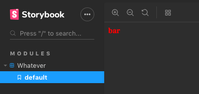

# Storybook Monorepo Bug

## Bug description

When storybook starts, only the last story added in `loadStories` is available. 

Even though 3 stories were added to Storybook, only the last one shows up.
This can be seen in following screenshot:



## To reproduce bug

**Install and link dependencies**

```
yarn bootstrap
``` 

**Start Storybook**

```
yarn modules:storybook
```

## More details

- builds typescript using `@babel/preset-typescript`
- babel and storybook configs are kept in their own packages `packages/configs/babel-config`and `packages/configs/storybook-config`
- still happens without `styled-components`, `react-primitives`
- still happens with the default babel config (extended for typescript)
- still happens on Storybook versions 5.1.0-alpha.20, 5.0.6, 5.0.5, and 5.0.0
